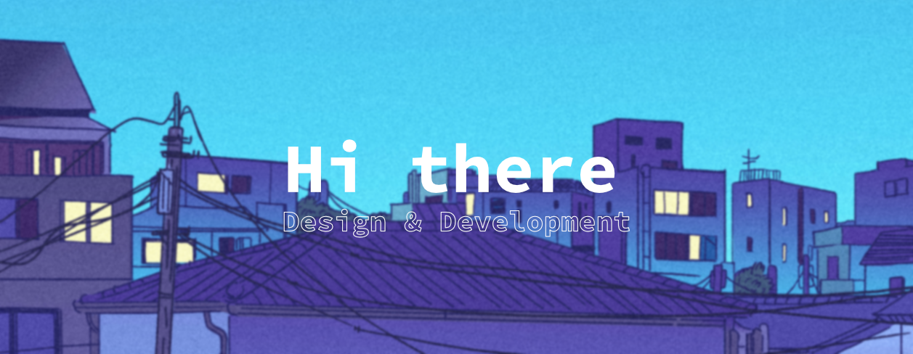

<!--Summary:
  - Introduction
  - Experiences
  - Skills
  - Example Projects
  - hobbies
  - study goals
  - ...
-->

# **Welcome to my Profile** 👋

```SWIFT
struct Kilian: Developer {
  let name = "Kilian Balaguer"
  let pronouns = "he/him/his"
  let role = "iOS & macOS Developer, Beta tester"
  let location = Coordinate2D(52.2434979, 5.6343227),  // Netherlands aka Holland
  let languages = ["fr-FR", "nl-NL", "de_DE", "en_US", "es-ES", "ar-MA"]
  let skills = ["Swift", "C#", "C++", "C", "JavaScript", "HTML", "CSS", "TypeScript", "NextJS", "React", "Kotlin"]
  let favouriteLanguage = ["Swift", "React", "NextJS"]
  
  func sayHi() {
    print("Hey, thanks for dropping by, feel free to have a look at my work! 🙂")
  }
}

let me = Kilian()
me.sayHi()
```

### Design and Development

Hi, I'm Kilian from France (living in the Netherlands), and I do Graphic Design and Development ~~in my free time~~.

## Hobbies

👨‍💻 Programming

🎵 Produce and listen to music

👨‍🍳 Cooking

🎹 Play the piano, guitar, bass and drums.

♟️ Play chess

## My Goals for 2024 🗓️

- Expand my SwiftUI skills
- Expand my german (yeah [Nevio Hirani](https://github.com/N3v1) im talking to you lol)
- Learn more chess tactics
- Find a loyal, honest, respectful and cute girlfriend

## Skills

<p align="center"> <strong style="font-size:30px;">Tools</strong> </p> <p align="center"> <a href="https://skillicons.dev">  </a> </p>

<p align="center"> <strong style="font-size:30px;">Programming Languages</strong> </p> <p align="center"> <a href="https://skillicons.dev">  </a> </p>

<p align="center"> <strong style="font-size:30px;">Other Technologies</strong> </p> <p align="center"> <a href="https://skillicons.dev">  </a> </p>

## My Stats

<!---->
<div align=center>


<!--
-->


</div>
